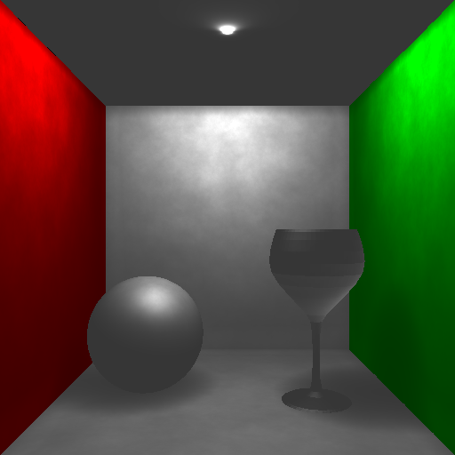
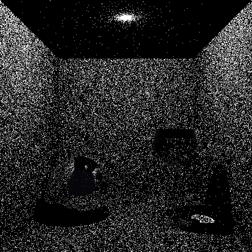
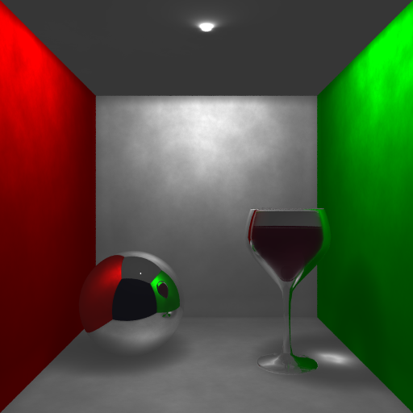
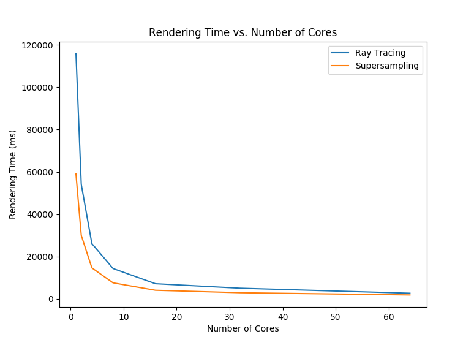
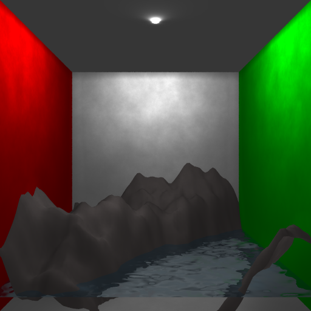
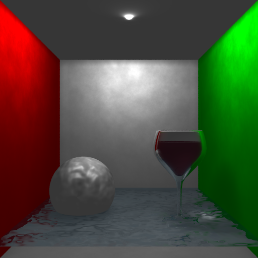
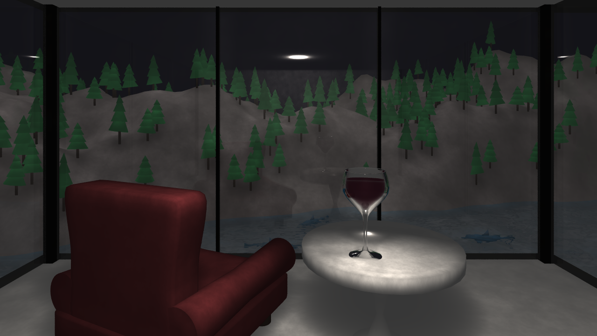

Mountainside Lair
=

Different Cornell box scenes have been rendered for easy verification of all objectives. Some sets of test images showcase multiple objectives as indicated by the title.

## Adaptive Anti-aliasing (Stochasic Sampling), Phong Shading

> Aliasing artifacts in the geometries are smoothed and vertex normals are interpolated for smooth shading. Lighting for the wine glass is a little strange because photons from the other side of the mesh are being collected.

## Photon Mapping (Building & Using), Reflection & Refraction

> Photons are visualized [left] by illuminating a pixel if there is a photon within $2.5 \cdot 10^{-3}$ units away from the point of intersection. The neartest $500$ photons are collected [right] for lighting calculations.

## Multithreading

Cores | Ray Tracing (ms) | Supersampling (ms)
--- | --- | ---
1 | 115945 | 58980 
2 | 54146 | 30052
4 | 26125 | 14665
8 | 14352 | 7581
16 | 7167 | 4083
32 | 5052 | 2908
64 | 2681 | 1858 

> Approximately linear in the number of cores. Timing data is obtained from rendering the Cornell box with ray tracing.

## Mountains Generated by Noise Function, Bump Mapping (Water & Mountains)

> Mountains looked bad when bump mapped so I decided to show a bump mapped sphere instead. This is because they are scaled from the space they were generated in so the partial derivatives are wrong.

## Model Pine Trees & Supervillain's Lair, Static Scene (Mountains, Pine Trees, Supervillain's Lair, Water)

> Every objective plays an important part in the final scene.
>
> - **Adaptive Anti-aliasing** for a smoother image.
> - **Refraction & Reflection** are used for the windows, wine, and water.
> - The scene renders in 45s on the Waterloo CS server thanks to **Multithreading** and the **KD-Tree Optimization**.
> - All geometries modelled in the **Pine Trees & Supervillain's Lair** objective are present in the scene.
> - **Mountains Generated by Noise Function** are used for the background mountainous region.
> - **Bump Mapping** is used to help simulate water.
> - **Phong Shading** is used to smoothly shade all the meshes in the scene.
> - **Photon Mapping** is for cool lighting effects and better overall illumination.

## [Extra] KD-Tree Optimization

Mesh | Number of Faces | Percentage Left
--- | --- | ---
tree_stump | 124 | 0.19811470066225143
tree_leaves | 56 | 0.2849103479229166
mountains | 7938 | 0.00691777290299551
shark | 882 | 0.025298249939564917
chair | 2270 | 0.02325969022781052
chair_legs | 496 | 0.024951764204871118
table | 572 | 0.059862970952015045

> Cuts rendering time on the CS server to around 45s from > 60s. Exact timing is unknown because the rendering process times out (gets kicked from the server) without the feature.
